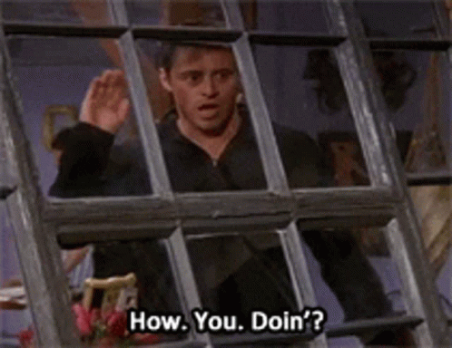
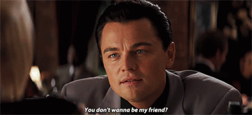
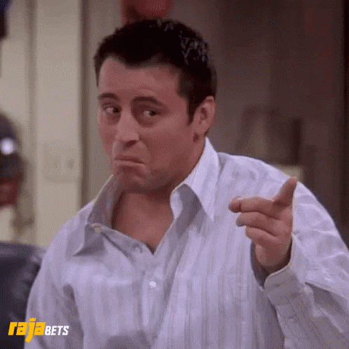

<h1 align="center">
    
</h1>

  

<h1 align="center"></h1>
<!-- name highlight ending -->
<h1 align="center">
    
</h1>

  

        
<h1 align="center"></h1>

  

  

 
  

    
 🔭 I’m currently working on **a Wallet App**
 
 🌱 I’m currently learning **Spring Boot, MongoDB, ReactJS, Docker**

💬 Ask me about **Java, Terraform, MySQL or Microsoft Azure**

📫 How to reach me: **DEV.HARSHPAL@GMAIL.COM**

⚡ Fun fact   &nbsp;
  

**And**  
&nbsp;
  
 
 

  <!-- - 🤝 I’m looking for help with [any](https) -->

<!-- - 👨‍💻 All of my projects are available at [http](http) -->

<!-- - 📝 I regularly write articles on [http](http) --> 

<!-- - 📄 Know about my experiences [http](http) -->

 
<h1 align="center"></h1>
<h2 align="center">🤝 Socials 🤝</h2>

    

  

<h1 align="center"></h1>
<h2 align="center">⚒️ Languages-Frameworks-Tools ⚒️</h2>
 
<h4 align="center">⚡Good Exposure⚡</h4>

 

 
<h4 align="center">🔭 Learning Queue 🔭</h4>
    
 

 

<h3 align="center">Support:</h3>
    

    
  <h2>🐍 My Contributions 🐍</h2>
   
<!--    -->
    

     

&nbsp;

 

 

